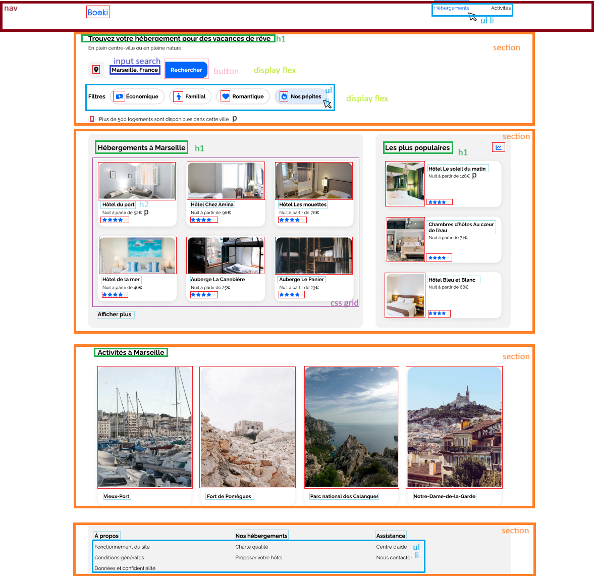

# Booki — Projet d'intégration HTML/CSS

## Présentation

Booki est un projet réalisé dans le cadre de la formation **Développeur Web** chez OpenClassrooms.

L'objectif est d'intégrer en HTML et CSS l'interface d'un site permettant aux utilisateurs de **rechercher des hébergements et des activités** dans la ville de leur choix.

Le projet est réalisé à partir de maquettes Figma fournies par l'UI designer, en collaboration avec la CTO.



---

## Fonctionnalités intégrées

- **Header** avec logo et navigation (liens Hébergements / Activités)
- **Barre de recherche** avec un champ texte et un bouton (texte sur desktop, icône loupe sur mobile)
- **Filtres** de recherche (Économique, Familial, Romantique, Nos pépites)
- **Section Hébergements à Marseille** — grille de cartes avec image, titre et prix
- **Section Les plus populaires** — cartes horizontales mettant en avant les meilleurs hébergements
- **Section Activités à Marseille** — grille de 4 colonnes avec grandes images
- **Footer** en 3 colonnes avec liens de navigation
- **Responsive design** : desktop (≥ 1024 px), tablette (≤ 1024 px), mobile (< 768 px)

---

## Technologies utilisées

| Technologie | Usage |
|---|---|
| HTML5 | Structure sémantique des pages |
| CSS3 | Mise en page (Flexbox), responsive (Media Queries) |
| [Google Fonts — Raleway](https://fonts.google.com/specimen/Raleway) | Typographie |
| [Font Awesome 6](https://fontawesome.com/) | Icônes |

---

## Structure du projet

```
booki/
├── index.html          # Page principale
├── css/
│   └── style.css       # Feuille de style principale
├── images/
│   ├── logo/           # Logo Booki
│   ├── hebergements/   # Photos des hébergements
│   └── activites/      # Photos des activités
└── README.md
```

---

## Contraintes techniques respectées

- Largeur maximale : **1440 px** — largeur minimale : **320 px**
- Media queries : `<= 1024 px` (tablette) et `< 768 px` (mobile)
- Marges et paddings en **pixels**, largeurs en **pourcentages**
- Propriété `object-fit` sur les images pour éviter les déformations
- Convention de nommage CSS : **kebab-case** (ex. `.main-container`)
- Attributs `alt` présents sur toutes les images
- Code validé avec les validateurs **W3C HTML** et **W3C CSS**

---

## Lancer le projet

Aucune installation requise. Il suffit d'ouvrir le fichier `index.html` dans un navigateur.

```bash
# Cloner le dépôt
git clone https://github.com/<votre-username>/booki.git

# Ouvrir dans le navigateur
open index.html
```

---

## Auteur

**Colin Cyril** — Étudiant développeur web, OpenClassrooms
